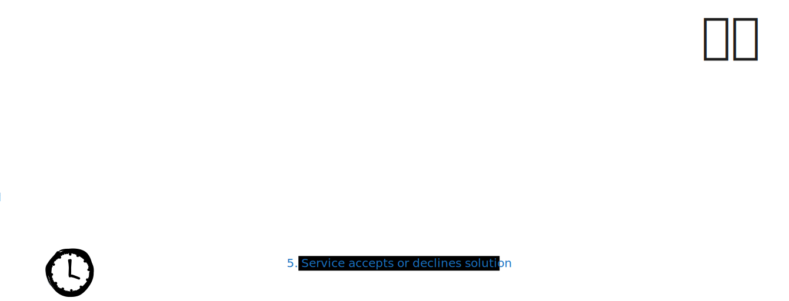

# Project Title: `Deadline knapp verPARSEd`

Group Members: `Johann Sebastion Schicho, 12405408; Sophie Pokorny 01633652; Tim Manuel Lehner, 12434704`

## Introduction & Problem Field

```
For CTF:
- Describe the core idea and vulnerability.
- Why is this specific vulnerability relevant?
```

We implemented a web service, from which you can download a C program that implements a configuration loader.
The configuration loader parses and validates nginx configuration files.
The configuration loader is a program that may read multiple config files and parses them and outputs one combined configuration.

Somewhere hidden layers deep in this configuration loader, through a specially crafted config file a `system()` call may be executed with arbitrary user input. The flag is the function, which calls this `system()`.

The challenge is that the C code is obfuscated randomly per download and the flag needs to be entered within 60 seconds in the web service. Thus, manual search through the code is not possible.

Our vulnerability is an (ordered on Temu) hommage to the Log4Shell vulnerability, which insecurely trusts user input without proper sanitization in a logging call, which allows arbitrary code execution.

Our vulnerability is relevant as improper input sanitization is a story that keeps on giving.
This problem is getting more severe with AI Agents producing code which looks fine but contains attack vectors which are not easily deteced on first sight.

By solving this challenge users get familiar with the tool Joern,
which allows code analyzation using code property graphs. They learn how to use the tool and how to search and detect flows in programs.

## Core Work

```
For CTF:
- Detail the architecture of your challenge and design decisions you made.
- What is the intended solution path (i.e. from not-knowing to getting the flag)?
- What is the necessary knowledge of someone trying to solve the challenge?

For Both:
- What technical problems did you encounter, and how did you handle them?
```
### Architecture
Our code is split into three main components which also resemble the main contents of our challenge:
Firstly the configloader contains the actual unobfuscated code of the nginx config loader. This code can be run and contains a vulnerability which enables to run arbitrary system calls.

Secondly, the obfuscator obfuscates the configloader code, i.e. file, function and variables names, and macros and puts them into a seperate subfolder. We paid attention that the output produced by the obfuscator can still be compiled so the students could actually run the program by themselves and play around with it.
The obfuscator does rather simple obfuscation since we do not want to make the obfuscation and thus the challenge too hard. Further, most open source obfuscators are working on a compiler level than on a C level, this however would complicate the challenge even more.

Lastly, the webservice contains the code for actually running the challenge. It contains a Dockerfile which can be run for easy startup. The students can then access the challenge website, where they can press a button to start the challenge. This runs the obfuscator and lets the user download the freshly obfuscated files.
The user has then a time window of 60 seconds to analyze the code and return the name of the correct function name to solve the challenge successfully.




### Solution Path
The intended solve path is to understand the program generally and find the vulnerability, even though the timer of 60 seconds has then long run out. Next, the attacker should write a `joern` rule, which can find the attack path, i.e. the vulnerable function's name, regardless of obfuscation.

Executing the `joern` rule on top of a newly downloaded and obfuscated version of the program allows the attacker to find the vulnerable function's name within 60 seconds and solve the challenge by entering the name into the web service.

Finding the right function name can be achieved by running following commands:

1. Start joern in the directory of the unzipped code directory
```joern```
2. import the code by typing into the joern shell:

```sc
importCode(inputPath=".", projectName="ctf")
```
3. Define the source and sink:
```sc
def sink = cpg.call("sys_run")
def source = cpg.call("open_cfg_file") 
```

4. Get the sinks which are reachable by these flows:

```sc
sink.reachableByFlows(source).p
```

%TODO rest

%TODO (basti) ich muss das noch überarbeiten


### Knowledge needed for this challenge
To solve this challenge, the user needs to know how system calls work and what makes them unsafe. They also need to know how to work with joern, this can however be learned rather quickly or the user could be supported by giving hints if they are stuck.


## Conclusion & Future Work

```
What are the limitations of your current implementation?
If a future student were to pick up this project, what is the logical "next step"?
```

Logical next steps would be to add new vulnerabilities, where then one is randomly picked and add to the code.

Overall this project is a nice and interesting way to learn about the use of joern, the obfuscation of code and hidden configuration errors which should be considered and tested thorougly when pushing software to production.

## Generative AI (If Applicable)

```
Provide a brief summary of how generative tools actually influenced the project compared to your initial proposal.
```
Only minimally, it helped creating the style.css of our webservice to speed up development.